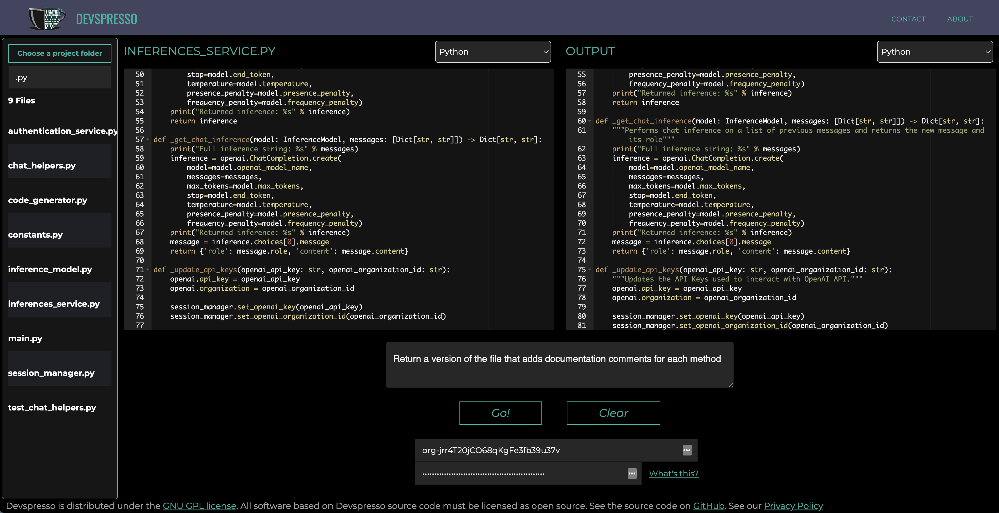

# Devspresso
Devspresso is an open-source coding tool designed to let developers delegate coding to an LLM via text prompting, similar to how one would do code reviews or pair programming.
See the [video demo walkthrough](https://www.loom.com/share/9a167b3cdb684b39885731c44322134f)

## Uses
The tool is particularly good at well-defined, repetitive coding tasks. Examples include:
- Writing tests for single functions/methods.
- Converting literal data formats from one form into another.
- Automating trivial code refactor tasks like renaming or indentation.
- Improving the style of code.
- Commenting code.

In addition, the code is well-versed at implementing algorithms, and can effectively implement the types of math-heavy or corner-case-heavy functions that humans tend to be less effective at.

## Contributing
Follow pull request guidelines in [CONTRIBUTING.md](./CONTRIBUTING.md).
### Issues
To report an issue, send an email to info@devspresso.app, or join our [public Slack channel](https://join.slack.com/t/devspressoworkspace/shared_invite/zt-1s4j5nnw2-~fM~6_~7bVhO_IOLU8CPYw).

### Roadmap
Several core improvements on the roadmap:
- Code diff view for the current file vs. generated output
- Ability to save current file and/or generated output to disk
- Ability to select underlying code gen model
- Shortcut list for common coding tasks
- Ability to chunk input for larger input sizes

Devspresso is distributed under the GNU GPL license. All software based on Devspresso source code must be licensed as open source.
